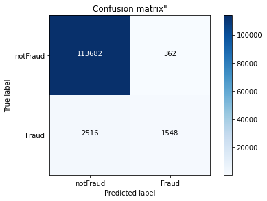
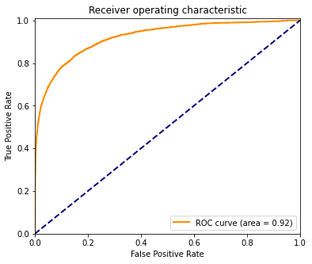
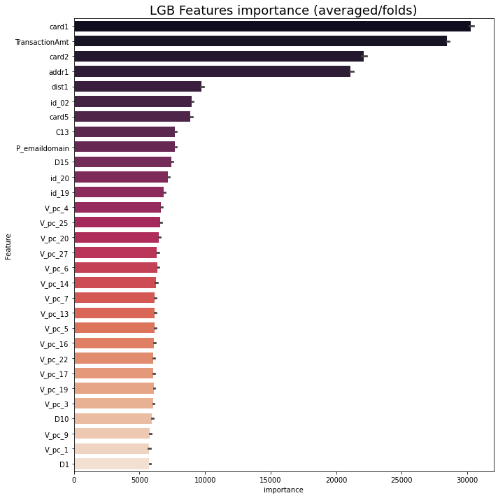

# Fraud Detection 

## About 

The problem is raised by IEEE-CIS seeking the best solutions for fraud prevention. 
The dataset, provided by Vesta Corporation, is a real-world e-commerce transactions and contains a wide range of features from device type to product features. 
Successfull solution will improve the efficacy of fraudulent transaction alerts for millions of people around the world, helping hundreds of thousands of businesses reduce their fraud loss and increase their revenue.

The data is broken into two files : Identity and Transaction, which are joined by TransactionID.
Variables in Identity contain information such network connection information (IP, ISP, Proxy, etc) and digital signature (UA/browser/os/version, etc) associated with transactions.
There are total of 40 features for identity information, they are masked, and of course they are high in number of missing values. There are total 
Variables in Transaction contain information such transaction amount, timedelta, product purchased, card, address, distance, email, countings associated with the cards, match status, and Vesta rich generated features.
Most of them are masked, though some insights about the features might be found by exploring the data, and high in number of missing values.

[more](https://www.kaggle.com/c/ieee-fraud-detection/overview)

## Goals

1. Build a model with reasonable approach and fine result.
2. Deploy the problem solution to a web-app

         
## Model

Using [LGBM](https://lightgbm.readthedocs.io/en/latest/index.html) and [StratifiedKFold](https://scikit-learn.org/0.21/modules/generated/sklearn.model_selection.RepeatedKFold.html#sklearn.model_selection.RepeatedKFold) worth a further exploration and tuning.
By looking feature importance, feature engineering applied also show they works fine.

 

## WEB APP

ongoing
